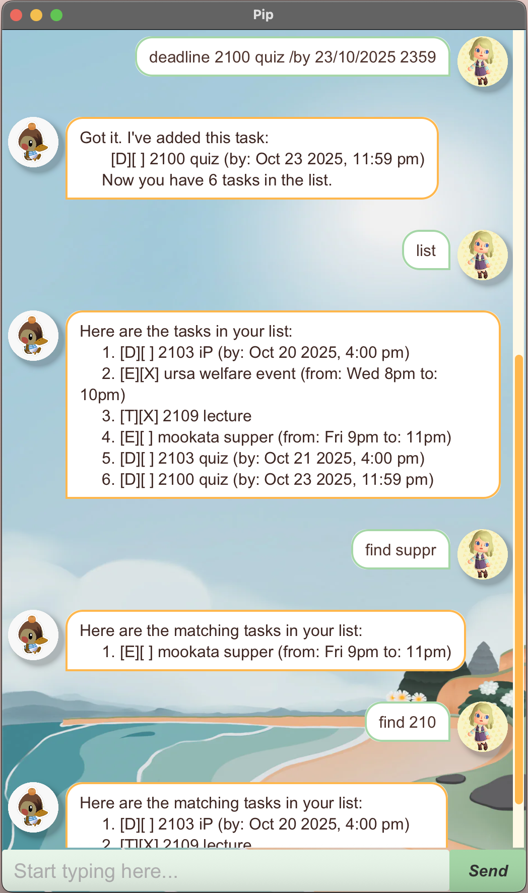

# Pip User Guide



Pip is a tiny task manager you control with simple commands. It supports adding todos, deadlines, and events.
- Fast text commands 
- Flexible date/time parsing 
- Fuzzy search with minor-typo tolerance 
- Automatic save/load

## Adding todos
**Action & outcome:** Create a simple task. Pip confirms the add and saves automatically.
**Usage:** `todo <description>`
**Example:** `todo Make 2101 presentation slides`
**Expected outcome:**
```
Got it. I've added this task:
[T][ ] Make 2101 presentation slides
Now you have 1 tasks in the list.
```

## Adding deadlines
**Action & outcome:** Create a task with a due date/time. Pip parses flexible date formats, confirms the add, and saves.
**Usage:** `deadline <description> /by <date-or-datetime>`
**Example:** `deadline 2103 Quiz /by 2/10/2025 1600`
**Expected outcome:**
```
Got it. I've added this task:
  [D][ ] 2103 Quiz (by: Sep 2 2025, 4:00 PM)
Now you have 2 tasks in the list.
```

## Adding events
**Action & outcome:** Create an event with a start and end. Pip confirms the add and saves.
**Usage:** `event <description> /from <start> /to <end>`
**Example:** `event Camp /from Mon 9am /to Wed 5pm`
**Expected outcome:**
```
Got it. I've added this task:
  [E][ ] Camp (from: Mon 9am to: Wed 5pm)
Now you have 3 tasks in the list.
```

## Listing tasks
**Action & outcome:** Show all tasks in order. If there are none, Pip shows a message.
**Usage:** `list`
**Expected outcome:**
```
1. [T][ ] Make 2101 presentation slides
2. [D][ ] 2103 Quiz (by: Sep 2 2025, 4:00 PM)
3. [E][ ] Camp (from: Mon 9am to: Wed 5pm)
```

## Finding tasks
**Action & outcome:** Search task descriptions using one or more keywords (case-insensitive). Each term must match; minor typos (edit distance ≤ 1 per term) are tolerated.
**Usage:** `find <keyword(s)>`
**Example:** `find canp     # matches "camp" (one-character typo)`
**Expected outcome:**
```
Here are the matching tasks in your list:
1. [E][ ] Camp (from: Mon 9am to: Wed 5pm)
```

## Marking task
**Action & outcome:** Mark a task (by its list index) as done. Pip updates the task and saves.
**Usage:** `mark <index>`
**Example:** `mark 3`
**Expected outcome:**
```
Nice! I've marked this task as done:
  [E][X] Camp (from: Mon 9am to: Wed 5pm)
```

## Unmarking task
**Action & outcome:** Mark a task (by its list index) as not done. Pip updates the task and saves.
**Usage:** `unmark <index>`
**Example:** `unmark 3`
**Expected outcome:**
```
OK, I've marked this task as not done yet:
  [E][ ] Camp (from: Mon 9am to: Wed 5pm)
```

## Deleting task
**Action & outcome:** Remove a task (by its list index). Pip confirms removal and saves.
**Usage:** `delete <index>`
**Example:** `delete 3`
**Expected outcome:**
```
Noted. I've removed this task:
  [E][ ] Camp (from: Mon 9am to: Wed 5pm)
Now you have 2 tasks in the list.
```

## Exiting
**Action & outcome:** Close Pip.
**Usage:** `bye`